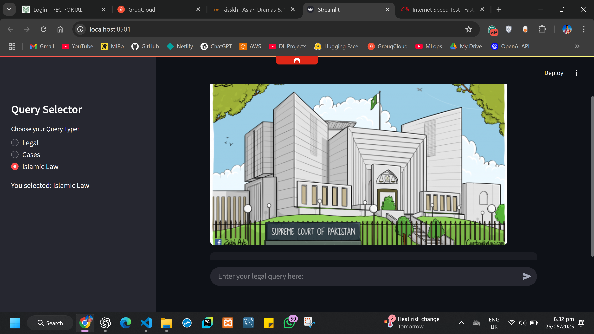
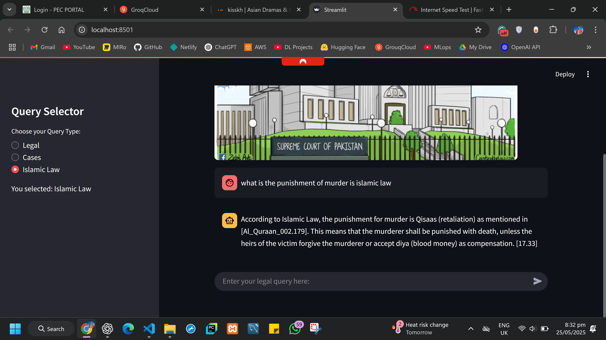

---

## ⚖️ Legal Assistant Pakistan 🇵🇰

A Streamlit-based AI assistant designed to help users navigate Pakistan's legal system by retrieving relevant information from vector databases and generating accurate, context-aware responses using LLMs.


---
### Streamlit UI



### ChatBot Working


### 📌 Features

* ✅ Multi-domain Legal Query Support (General Legal, Case Law, Islamic Law)
* 🔍 Semantic search with [FAISS](https://github.com/facebookresearch/faiss)
* 🧠 Embeddings via `sentence-transformers/all-MiniLM-L6-v2`
* 📑 CrossEncoder reranking with `cross-encoder/ms-marco-MiniLM-L6-v2`
* 🤖 Powered by `LLaMA3-70B` via [Groq's API](https://console.groq.com/)
* 🧵 Conversational memory using `st.session_state`
* 🧰 Modular prompt parsing via `prompt_parser.py`

---

### 🗂 Directory Structure

```plaintext
├── app.py                         # Main Streamlit app
├── Images/
│   └── 14th-July-Supreme-Court-final-640x360.png
├── vector_store/
│   ├── Cases/                     # FAISS index for case law
│   ├── Legal/                     # FAISS index for legal principles
│   └── Islamic/                   # FAISS index for Islamic law
├── src/
│   └── prompt_parser.py          # Custom prompt template logic
├── .env                          # Environment variables (Groq API key etc.)
└── README.md
```

---

### 🧪 Setup Instructions

#### 1. **Clone the repository**

```bash
git clone https://github.com/Haseeb1511/AI_lawyer_chatbot.git
cd legal-assistant-pakistan
```

#### 2. **Create and activate virtual environment**

```bash
python -m venv legal
legal\Scripts\activate           # On Windows
```

#### 3. **Install dependencies**

```bash
pip install -r requirements.txt
```


#### 4. **Set up your `.env`**

```env
GROQ_API_KEY=your_groq_api_key_here
```

#### 5. **Run the app**

```bash
streamlit run app.py
```

---

### ✨ How It Works

1. **Embeddings & FAISS**: Vector databases for legal, case, and Islamic documents are loaded using HuggingFace sentence transformers.
2. **Retrieval**: Similar documents are fetched using FAISS.
3. **Reranking**: Results are reranked using `cross-encoder/ms-marco-MiniLM-L6-v2`.
4. **Contextual Compression**: LangChain's `ContextualCompressionRetriever` keeps only the most relevant info.
5. **LLM Response**: Query + reranked context is sent to `llama3-70b-8192` via Groq API.
6. **Display**: Streamlit shows chat-style response and stores session history.

---

### 🛠️ Customization

* **Prompt customization**: Modify `src/prompt_parser.py`
* **LLM model**: Change in `ChatGroq(model="llama3-70b-8192")`
* **Retriever settings**: Modify `search_kwargs={"k": 3}` to fetch more/less docs.

---

### 🧾 License

This project is licensed under the MIT License.

---